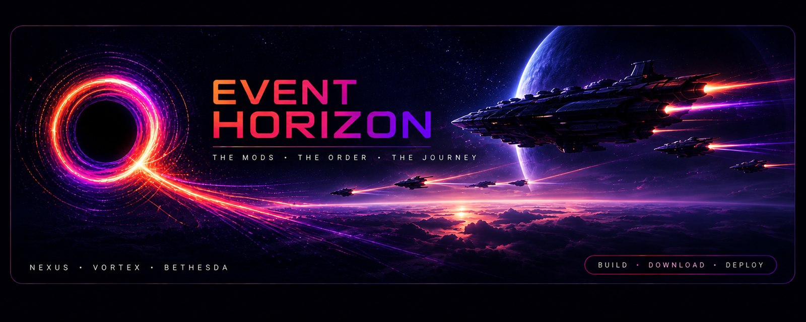

<p align="center">
  
</p>

# Event Horizon

> *Vortex is a black hole. Collections, rules, FOMOD selections, conflict overrides — they all get pulled in and never come out the same on the other side. Event Horizon is the boundary that captures everything **before** it crosses over.*

A [Vortex](https://www.nexusmods.com/about/vortex/) extension that captures a curator's exact mod state into a portable, hash-verified `.ehcoll` package — and reproduces it on someone else's machine.

**Requires Vortex 2.x.** Built against `@nexusmods/vortex-api` 2.6.0-beta.2 (React 18); it will not run on Vortex 1.16. Windows and Linux/Proton are both supported targets.

---

## Status — alpha, v0.1.0-alpha.20

Everything described below is built and running. It has been exercised end to
end against a real 954-mod Fallout 4 profile, on Windows and on Linux under
umu/Proton. 1,077 tests across 101 files cover it.

What that does **not** mean:

- It has not been through a tagged public release.
- Reproduction is verified by hashing, not by launching the game. "The files
  match" is what we prove; "the game plays identically" is what you hope
  follows.
- One captured thing is still recorded and never applied — see
  [Known gaps](#known-gaps). Read that section before you rely on the word
  "deterministic".

Tested on Bethesda titles (Fallout 4 primarily, Skyrim SE, Skyrim).

---

## Why this exists

Vortex's collection system is a good idea that loses state. Rules go missing,
FOMOD selections get dropped, file overrides reset, and "the same collection"
produces different installs on different machines — silently, which is the part
that costs you a weekend.

Event Horizon attacks it from the other end. Capture **every** load-bearing
piece of state on the curator's side into a package that carries its own
hashes, then rebuild it on the user's side through Vortex's low-level
installer and deploy primitives. It never enters the vanilla collection
codepath.

Two design positions do most of the work:

**The curator's disk is not the source of truth.** A curator's staging folder
can be quietly corrupt, and hashing it would make that corruption the
reference every user is measured against. Identity comes from the archives, and
drift is measured against *our own previous install*, never against the
curator's machine.

**Sequential, not concurrent.** Vortex loses files when mods install in
parallel. Installing one at a time is slower and is a correctness property, not
a performance oversight.

---

## What it does

### Capture (curator side)

Snapshots the active profile: mod identity and archive SHA-256, enabled state,
collection membership, FOMOD selections, mod rules, file overrides, enabled INI
tweaks, install order, load order, per-modtype deployment manifests, and the
ESL/light flag on every plugin.

Packs it into a `.ehcoll` — a self-contained ZIP with a `schemaVersion: 1`
`manifest.json`. External mods that cannot be linked can be bundled into the
package itself.

### Reproduce (user side)

Reads the package, resolves every mod against what the user already has,
downloads or extracts the rest, and installs them **one at a time**. Then:

- **Verifies** each installed archive by SHA-256, reporting `matches`,
  `differs`, `damaged`, or `unknown`. The `differs`/`damaged` split matters:
  only a damaged archive is fixed by downloading again, and only that one is
  not the curator's problem.
- **Replaces** the user's mod rules and LOOT userlist with the collection's —
  it does not merge. Everything is backed up first, and the backup landing on
  disk is an interlock, not a courtesy. Merging produces a rule set that exists
  on nobody's machine but theirs, and it fails invisibly: every file verifies,
  and the game still loads something else.
- **Pins** the curator's plugin order and restores ESL flags. Plugins the user
  has that the collection does not know about are integrated LOOT-style, not
  appended last.
- **Replays the curator's FOMOD answers**, and asks once, before the driver
  starts, whether to show them. `installerChoices.ts` hands them to Vortex's
  installer as `IChoiceType` on `start-install-download`; `unattended` decides
  whether Vortex opens each installer with the answers pre-filled or applies
  them without asking. Silent is the default — a tester's run had a median
  per-mod time of 4 ms against a 99th percentile of 491 **seconds**, all of it
  a human reading dialogs. The modal has no preselected answer, because
  choosing to differ from the curator has a consequence you cannot guess: the
  Doctor repairs from the collection, so healing that mod later restores the
  curator's answer over yours.
- **Applies the collection's INI tweaks and game settings.** A mod's optional
  `ini tweaks` are re-ticked additively — it never unticks one the user chose
  — and the game INI is written once per release, never re-asserted.
- **Writes a receipt**, which is the only record of cross-release lineage.

Every ending leaves a trace. A success writes the receipt; a crash leaves a
marker behind; a failed or cancelled run writes an attempt record saying which
phase it stopped in and how far it got. All three surface in **My
Collections** — before this, a run that stopped at 963 of 967 mods left a
machine full of staged mods and a page that said you had none.

### Refuses to start work it cannot finish

An hour into a 900-mod install is the worst place to learn the machine was
never able to do it. Two gates run before anything is written:

- **A dead extractor blocks the install.** Only a fatal verdict — a broken
  `list` with working extraction does not block, because the listing paths are
  native-first — and a collection needing no unpacking is still allowed
  through. It offers to install the Microsoft runtimes itself, then re-runs the
  7-Zip self-test and reports what *that* said rather than trusting an exit
  code.
- **No deployment method blocks the install.** Vortex can stage every mod
  perfectly and still have no way to link them into the game folder, which is
  common under Proton. This asks Vortex its own question
  (`getCurrentActivator`) and names the setting that fixes it. It only blocks
  on a definite *no* — if the check itself cannot run, the install proceeds.

Mid-run, one bad mod costs one mod rather than the run: failures are collected
and installation continues. A *streak* is treated as systemic and stops
immediately, and a failure that is a property of the machine rather than the
mod — "no deployment method active" — stops on its first occurrence instead of
repeating itself four hundred more times. Downloads retry with a backoff that
reads the shape of the failure: a deleted file answers in under a second and
is not worth waiting for, a rate limit hangs for twenty and is.

### Collection Doctor

Is this collection still what was installed? Measured against the **receipt**
— the only artefact describing a state this machine actually reached, so it
reports drift the user caused rather than drift the curator has.

Seven checks (profile, mods present, mods enabled, staged files, plugin order,
mod rules, LOOT rules), each in five states rather than pass/fail — `unknown`
is never rendered as a pass, because "we did not check" is not "it is fine".
Every finding that can be repaired names the pipeline step that repairs it, and
those repairs re-run the *same* functions the install used. Healing is disabled
while an install is running.

An expensive deep scan hashes every staged file on request. Three of the six
repairs need the `.ehcoll` on disk and say so on the button when it is missing,
rather than silently doing nothing.

### Checks your collection before you ship it

The curator is the one person who cannot notice a mod Nexus has deleted: their
copy is already on disk, so the collection builds and ships perfectly and fails
only on somebody else's machine. The build page asks Nexus about every mod —
one request per mod page, 780 for a 955-mod collection — and separates *file
gone* (an old version tidied away, with the current file named) from *page
gone* (usually deliberate). Old and archived files are listed too: they
download today, and they are how a collection quietly stops working.

A mod that can no longer be downloaded can be shipped as an **external
dependency** instead — identified by hash rather than by a Nexus id the user
cannot resolve — which puts it in the existing external-mods table with its
bundle, link and instructions.

### Audit

Export a snapshot to JSON and diff it later; diff a reference `plugins.txt`
against the live one. Reports are browsable in-app.

---

## Known gaps

Stated here rather than buried, because they bound the word "deterministic":

| Gap | Consequence |
| --- | --- |
| **`fileOverrides` are recorded, not applied.** | A real collection carries 4,382 entries. Nobody has measured whether they change the outcome. Only the build side reads the field; nothing on the install side does. |

The driver also does not roll back. A failed run leaves what it installed in
place and re-running picks up from there — deliberate, because a half-rolled-back
install is harder to reason about than a half-finished one.

---

## Install (users)

```
npm install
npm run build:vortex     # builds, then copies into %APPDATA%\Vortex\plugins\
```

Restart Vortex. **Event Horizon** appears in the sidebar.

To install by hand instead, copy `index.js`, `info.json`, `dist/` and `assets/`
into `%APPDATA%\Vortex\plugins\vortex-event-horizon\`.

For a distributable archive, `npm run package:extension` writes
`release/event-horizon-<version>.zip` with `info.json` at the archive root —
which is where Vortex looks, and the thing that zipping the project folder gets
wrong. See [`docs/PUBLISHING.md`](docs/PUBLISHING.md).

---

## The Event Horizon page

A React `mainPage` in the sidebar (global group — visible whatever game is
active), with eight sections: **Dashboard**, **Install**, **My Collections**,
**Doctor**, **Build**, **Plugin Diffs**, **Mod Diffs**, **About**.

Five actions are also registered on Vortex's own toolbars: Export Mods To JSON
and Compare Current Mods With JSON on `mod-icons`, Compare Plugins With TXT on
`gamebryo-plugin-icons`, and legacy Build/Install dialogs on `global-icons`.
The `global-icons` pair are deliberate fallbacks for scripted testing — **the
page is the supported UX.**

### Game support

Building a collection: `skyrimse`, `fallout3`, `falloutnv`, `fallout4`,
`starfield`. Plugin diffs additionally need a `%LOCALAPPDATA%` folder mapping
and currently cover `skyrimse`, `skyrim`, `fallout4`; anything else raises
`Unsupported gameId for plugins.txt`. Both lists are small tables — PRs welcome.

---

## Documentation

| Doc | Read it for |
| --- | --- |
| [`docs/business/`](docs/business/) | **Per-operation behaviour in plain English** — failure modes, edge cases, invariants. The contract; start here. |
| [`docs/ARCHITECTURE.md`](docs/ARCHITECTURE.md) | Code layout and execution flow |
| [`docs/DATA_FORMATS.md`](docs/DATA_FORMATS.md) | Exact shape of every JSON file read or written |
| [`docs/DEVELOPMENT.md`](docs/DEVELOPMENT.md) | Build, deploy, debug |
| [`docs/PUBLISHING.md`](docs/PUBLISHING.md) | Getting the **extension** to Vortex users |
| [`docs/DISTRIBUTING_COLLECTIONS.md`](docs/DISTRIBUTING_COLLECTIONS.md) | Getting a **collection** to its users — research, unbuilt |
| [`docs/PROPOSAL_INSTALLER.md`](docs/PROPOSAL_INSTALLER.md) | The original design doc. History: it is built, and its load-order reasoning has since been reversed. |

When a doc and the code disagree, the doc is the spec and the code is the bug —
until someone proves otherwise. A change in behaviour ships with its spec
update in the same commit.

---

## Development

```
npm test                 # vitest
npm run typecheck        # tsc --noEmit, src
npm run typecheck:test   # tests are typechecked separately, and must be
npm run build            # tsc
npm run package:extension
```

`typecheck:test` exists because the test files were not typechecked for most of
this project's life, which hid five shape drifts in tests that were passing.

### Tech

- TypeScript, strict, ES2019, CommonJS output
- **No bundler** — plain `tsc`; Vortex-provided modules stay external and are
  injected by the host
- **No runtime dependencies.** Everything in `devDependencies` is types or
  tooling.

**Reading a `.ehcoll` uses a hand-written zero-dependency ZIP reader**
(`src/core/manifest/readZip.ts`), not Vortex's 7-Zip. Shelling out to `7z.exe`
fails under a Wine/Proton prefix for reasons that have nothing to do with the
archive — a missing vcrun runtime in the prefix — and surfaces to the user as
`7z failed to list`, which reads as "your collection is broken" and is not.

The split is deliberate and asymmetric:

| | Uses |
| --- | --- |
| Reading our own `.ehcoll` | native `readZip.ts` |
| Listing an archive | native-ZIP-first, 7z fallback (`listArchive.ts`) |
| **Writing** a `.ehcoll` | still Vortex's 7-Zip (`packageZip.ts`) |
| Unpacking third-party mod archives (`.7z`, `.rar`) | Vortex's 7-Zip — the right tool, and ours cannot do it |

Writing stayed on 7-Zip because packaging is a curator-side operation and the
Proton failure is user-side. If curators start hitting it, that is the next
piece to move.

> `.npmrc` sets `legacy-peer-deps`. `@nexusmods/vortex-api` 2.6.0-beta.2 pins
> React 18 while also pinning `react-select@1.3.0`, whose peer range stops at
> React 16 — unsatisfiable under npm's strict resolution. Upstream builds with
> pnpm, which only warns. Nothing here is bundled, so the conflict is
> type-time only.

---

## License

[MIT](LICENSE).
